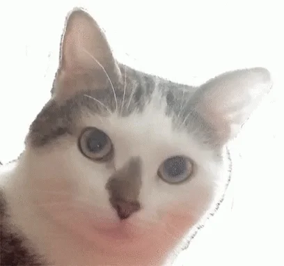
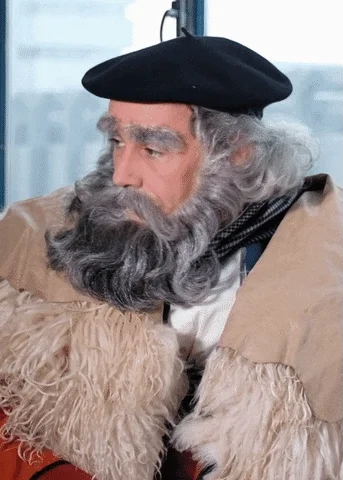
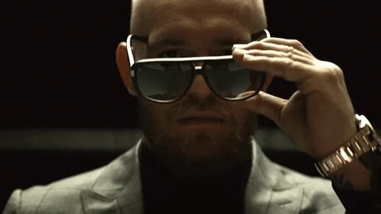

# :crossed_swords: Thug life #

## Introducción ##

Si no sabes lo que es un "Thug life" es que no has cursado todas las asignaturas de "1º de intenné".

Según Wikipedia:

> Thug Life fue una banda de hip hop americana compuesta por 2Pac, Stretch, Big Syke, Mopreme, Macadoshis, y The Rated R. En 1994 sacaron el álbum Thug Life: Volume 1, y el grupo se disolvió tras la muerte de Tupac el 13 de septiembre de 1996.

Su traducción sería: "Vida de gamberro", y para profundidad mayor os dejo el [siguiente enlace](https://vocatic.com/el-significado-y-origen-de-thug-y-de-thug-for-life)

Te dejo unas imágenes en la carpeta `images` sobre las que  tendrás que aplicar los elementos de la carpeta `starter-pack`, consiguiendo el efecto abajo mostrado.

## Requisitos ##

- HTML

- Transiciones y animaciones CSS

- Ninguna de las imagenes del starter-pack debe aparecer inicialmente en la imágen base.

- Has de utilizar la propiedad `position` y no `translate` en este caso.

### Échale un vistazo a esto ###

[CSS3 Filter](https://www.w3schools.com/CSSref/css3_pr_filter.asp)

## Iteraciones ##

### Transiciones ###

1. Selecciona una imagen y aplica, a través de pseudo-selectores como `hover`, `click` o `focus` las siguientes transiciones.

    1.1 Con desplazamiento vertical, coloca las gafas.

    1.2 Con desplazamiento horizontal, colora el cartel.

    1.3 Con desplazamiento vertical, pero en sentido contrario a las gafas, coloca el canuto.

2. Aplica rotación a las gafas.

_Premium_: Lleva la imagen a escala de grises.

### Animaciones ###

1. Selecciona una imagen y aplica las siguientes animaciones.

    1.1 Con desplazamiento vertical, coloca las gafas.

    1.2 Con desplazamiento horizontal, colora el cartel.

    1.3 Con desplazamiento vertical, pero en sentido contrario a las gafas, coloca el canuto.

2. Aplica rotación a las gafas.

_Premium_: Lleva la imagen a sepia.
