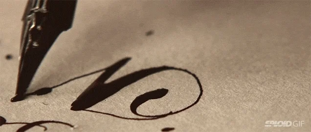

# :crossed_swords: Estilizando cartas #

## Introducción ##

Después de haber recibido el conocimiento maravilloso de la estética, hoy lo pondrás en práctica para estilizar una carta.

En el siguiente ejercicio, tendrás que realizar una carta aplicando las reglas de estilo de formateo de texto aprendidas.

## Requisitos ##

[Selectores CSS](https://www.w3schools.com/css/css_selectors.asp)

[Colores de texto](https://www.w3schools.com/css/css_text.asp)

[Font-family](https://www.w3schools.com/css/css_font.asp)

[Font-size](https://www.w3schools.com/cssref/pr_font_font-size.asp)

[Font-weight](https://www.w3schools.com/cssref/pr_font_weight.asp)

[Text-align](https://www.w3schools.com/cssref/pr_text_text-align.asp)

[Line-height](https://www.w3schools.com/cssref/pr_dim_line-height.asp)

[Quotes](https://www.w3schools.com/cssref/pr_gen_quotes.asp)

[Hyphens](https://www.w3schools.com/cssref/css3_pr_hyphens.asp)

[Text-decoration](https://www.w3schools.com/cssref/pr_text_text-decoration.asp)

[Vertical-align](https://www.w3schools.com/cssref/pr_pos_vertical-align.asp)

[Word-spacing](https://www.w3schools.com/cssref/pr_text_word-spacing.asp)

[Writing-mode](https://www.w3schools.com/cssref/css3_pr_writing-mode.asp)

[Word-wrap](https://www.w3schools.com/cssref/css3_pr_word-wrap.asp)

[Comentarios](https://www.w3schools.com/css/css_comments.asp)

## Iteraciones ##

1. Aplica la familia de tipografía

2. Cursivas, grueso de letra, tamaño...

3. Interlineados y espaciados de letra.

3. Ajustes menores y detalles finales, como separación de palabra.
