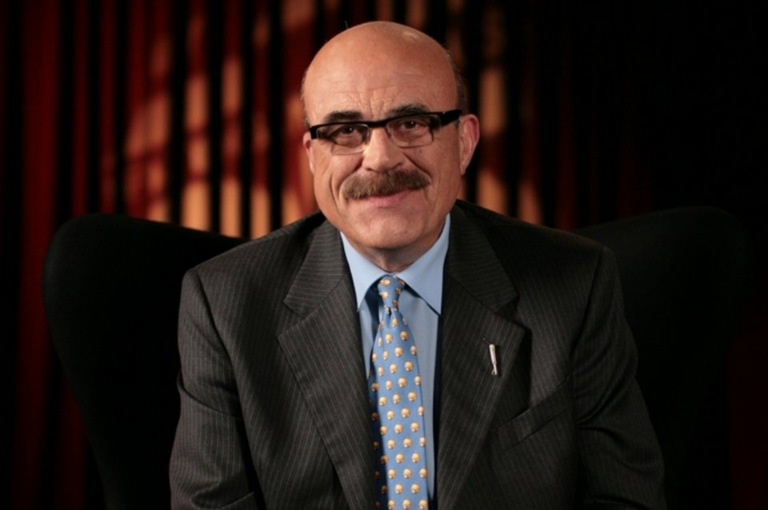

# :shinto_shrine: - Constantino Romero #

## Introducción ##



Constantino Romero García fue un presentador, locutor y actor de doblaje español.

En su voz han sonado míticas frases del cine mundial, como: "No, yo soy tu padre" pronunciada por James Earl Jones en El imperio contraataca; "Yo, he visto cosas que vosotros no creeríais...", por Rutger Hauer en el famoso discurso final de Blade Runner; "Volveré", pronunciada por Arnold Schwarzenegger en Terminator; "Me llamo Bond, James Bond", interpretando a Roger Moore. También realizó el doblaje de célebres personajes de películas de Disney como Claude Frollo en El jorobado de Notre Dame, Shere Khan en El libro de la selva, y el impertérrito Mufasa en El Rey León, el trabajo que más le conmovió.

## Requisitos ##

- Fundamentos de programación

- Arrays

- Funciones

- Objetos

- Colecciones

- String literals

## Iteraciones ##

Clona este repositorio para poder trabajar de modo local.


Tienes el siguiente objeto, que representa una pregunta cualquiera:

```javascript
const pregunta = {
    titulo: '¿A quién ha doblado más veces Constantino Romero?',
    respuestas: [
        {
            label: "Clint Eastwood",
            id: "clint-eastwood",
            name: "actor",
            value: "clint-eastwood",
        },
        {
            label: "James Earl",
            id: "james-earl",
            name: "actor",
            value: "james-earl",
        },
        {
            label: "Roger Moore",
            id: "roger-moore",
            name: "actor",
            value: "roger-moore",
        },
        {
            label: "William Shatner",
            id: "william-shatner",
            name: "actor",
            value: "william-shatner",
        },
        {
            label: "Arnold Schwarzenegger",
            id: "arnold-schwarzenegger",
            name: "actor",
            value: "arnold-schwarzenegger",
        }
    ]
}
```

Queremos convertir dicha pregunta en lo siguiente:

```javascript
    <form>
        <p>¿A quién ha doblado más veces Constantino Romero?</p>
        <label>Clint Eastwood</label>
        <input name="actor" type="radio" value="clint-eastwood">
        <label>James Earl</label>
        <input name="actor" type="radio" value="james-earl">
        <label>Roger Moore</label>
        <input name="actor" type="radio" value="roger-moore">
        <label>William Shatner</label>
        <input name="actor" type="radio" value="william-shatner">
        <label>Arnold Schwarzenegger</label>
        <input name="actor" type="radio" value="arnold-schwarzenegger">
    </form>
```


El primer paso es identificar que usaremos una función que, usando la variable `pregunta` como argumento, transformará un objeto en HTML. Dicha función ya está nombrada y se llamará `imprimePregunta`.

El proceso sería el siguiente: `pregunta` -> `imprimePregunta(pregunta)` -> `HTML`

Rellena las funciones siguientes:

- `imprimeTitulo`: Recibe la **pregunta completa** y devuelve **un string** con el titulo enmarcado en `<p>`

- `imprimeRespuestas`: Recibe la **pregunta completa** y devuelve **un string** con todas las preguntas. Dentro usa todas las funciones siguientes:

  - `imprimeRespuesta`: Recibe **una respuesta** de la colección e imprime **un string** compuesto del resultado de las dos siguientes funciones:

    - `imprimeLabel`: Recibe **una respuesta** e imprime **un string** con la propiedad `label` e `id` enmarcada de una etiqueta `label`.

    - `imprimeInput`: Recibe **una respuesta** e imprime **un string** con las propiedades `id`, `name` y `value` en una etiqueta `input` del tipo "radio".
