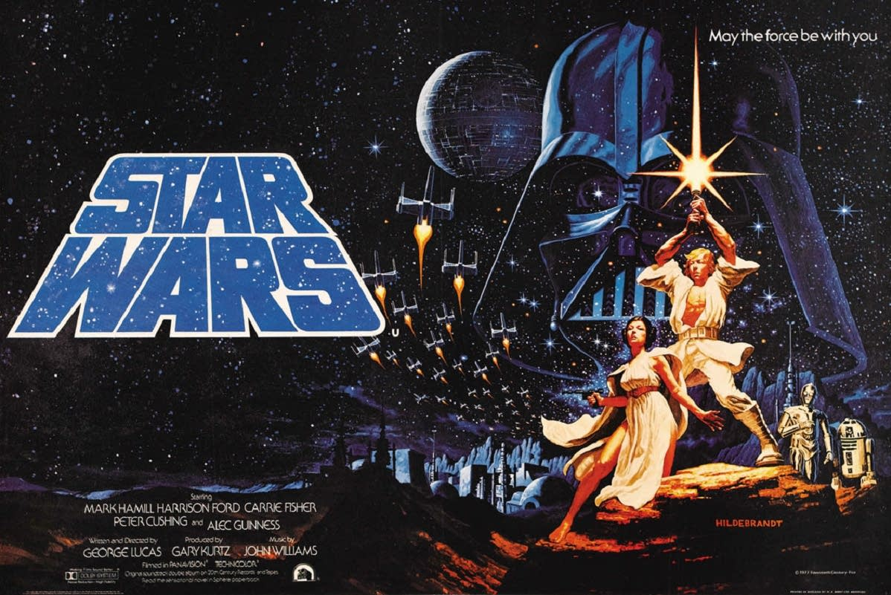

# :crossed_swords: La guerra de las galaxias #

## Introducción ##

Más de cuarenta años han pasado desde que llegara a las pantallas la película que ahora debemos llamar "La guerra de las galaxias -episodio IV: Una nueva esperanza".

Hasta ahora se han producido tres secuelas y cinco precuelas, dos películas para televisión y una animada, más de 300 novelas y 280 dibujos animados, el día de La Guerra de las Galaxias, videojuegos, camisetas...

No hay muchas personas que hayan dejado semejante huella en el mundo del entretenimiento como lo ha hecho Lucas.

Puede que Star Wars sea la franquicia más exitosa en la historia del cine, y quizás hubiera sido mejor si hubiera comenzado y terminado con una sola película, _"pero eso es otra historia y debe ser contada en otra ocasión"_.

## Requisitos ##

- Precurso web
- Asincronía en Javascript

## Iteraciones ##

Tu objetivo será mostrar las películas en el orden aquí presente. Para ello te valdrás de promesas y async-await modificando el código que te proveemos.

El orden de visionado, según su creador, sería el siguiente:
- "Episodio I: la amenaza fantasma"
- "Episodio II: el ataque de los clones"
- "Episodio III: la venganza de los sith"
- "Han Solo: una historia de Star Wars"
- "Rogue One: una historia de Star Wars"
- "Episodio IV: una nueva esperanza"
- "Episodio V: el imperio contraataca"
- "Episodio VI: el regreso del jedi"
- "Episodio VII: el despertar de la fuerza"
- "Episodio VIII: el último jedi"
- "Episodio IX: el ascenso de Skywalker"

_"Que la fuerza te acompañe"_

1. Convierte la función `printString` en una función asíncrona que resuelva una promesa una una vez haya escrito lo suyo. Esto no afectará al orden en que se muestran, pero nos permitirá usar promesas o async-await.

2. En la función `printPrecuela` usa las promesas para hacer que estas tres películas se muestren en el orden correcto. Esto no ordenará la lista completa, es evidente, pero verás que funciona porque estas 3 están ordenadas entre sí dentro del listado. Dicho de otro modo, nunca verás el Episodio I escrito después del Episodio II

3. Haz lo mismo para las funciones `printParalelas` y `printSecuelas`

4. Para la función `printOriginal` nos valdremos esta vez de async-await.

5. Para ordenar todas las películas, usaremos async-await en la función `printAll`

_"La fuerza estará ya contigo. Siempre."_

